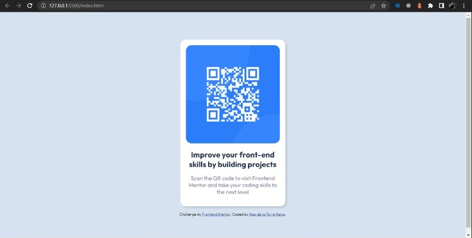
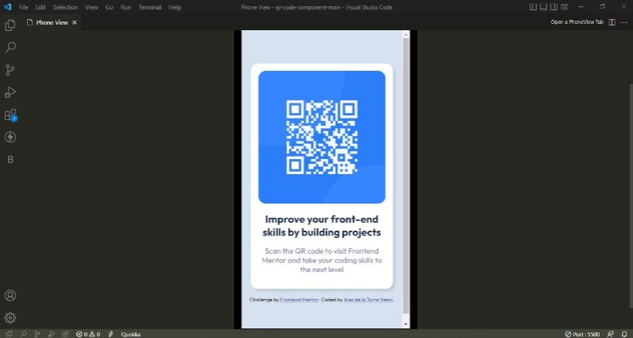

# Frontend Mentor - QR code component solution

This is a solution to the [QR code component challenge on Frontend Mentor](https://www.frontendmentor.io/challenges/qr-code-component-iux_sIO_H). Frontend Mentor challenges help you improve your coding skills by building realistic projects. 

## Table of contents

- [Overview](#overview)
  - [Screenshot](#screenshot)
  - [Links](#links)
- [My process](#my-process)
  - [Built with](#built-with)
  - [Continued development](#continued-development)
- [Author](#author)

## Overview

### Screenshot

Desktop View.

Mobile View.

### Links

- Solution URL: [Add solution URL here]()
- Live Site URL: [Add live site URL here](https://splendorous-croquembouche-57a1c8.netlify.app/)

## My process

I started by creating a div container to center the whole card, then continued with applying the styles to the background, image and texts.

### Built with

- Semantic HTML5 markup
- CSS custom properties
- Mobile-first workflow

### Continued development

By creating this QR component, I think it will be very useful in the future, as I can use this as a template in other websites or even a QR code generator, which nowadays are very useful for mobile devices.

## Author

- GitHub - [@Alex-T23](https://github.com/Alex-T23)
- Frontend Mentor - [@Alex-T23](https://www.frontendmentor.io/profile/Alex-T23)
- Linkedin - [Alex de la Torre Neira](https://www.linkedin.com/in/alex-de-la-torre-neira-6b1bb620a/)
